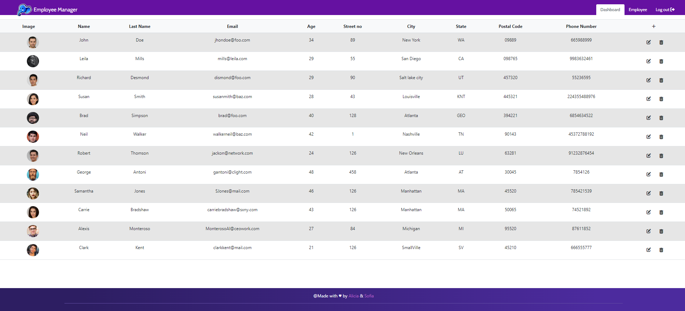

`#html` `#css` `#js` `#dom` `#JSON-server` `#JSON` `#PHP` `#Bootstrap 5`
<p>&nbsp;</p>


<p>&nbsp;</p>

# Employee Management System 

A fast, simple, elegant & powerful employee management system application powered by HTML, CSS, JS Vanilla.

Add, edit and remove employees from the application in an easy way.

Automatic logout after 10 minutes (session expired).

<p>&nbsp;</p>

# Preview 



<p>&nbsp;</p>

<h2 align="center">Gold sponsors 🥇❤️</h2>

<p>&nbsp;</p>


<p align="center">
  <a href="https://assemblerinstitute.com/" target="_blank">
    
  </a>
</p>

# Table of contents

<!-- toc -->

- [Getting started](#getting-started)
- [What can you do?](#What-can-you-do-in-blog-chain?)
- [Technologies](#Technologies)
- [Team](#Team)
- [Links](#links)
  * [Video](#video)
  * [Third-party tools](#third-party-tools)
  * [Linkedin](#Linkedin)


<!-- tocstop -->

# Getting started

First of all, you must launch the local API server created with JSON server to be able to fetch the data to the blog web page.

```
npm start
```

Also when doing requests, it's good to know that:

- If you make POST, PUT, PATCH or DELETE requests, changes will be automatically and safely saved to `db.json` using [lowdb](https://github.com/typicode/lowdb).
- Your request body JSON should be object enclosed, just like the GET output. (for example `{"name": "Foobar"}`)
- Id values are not mutable. Any `id` value in the body of your PUT or PATCH request will be ignored. Only a value set in a POST request will be respected, but only if not already taken.
- A POST, PUT or PATCH request should include a `Content-Type: application/json` header to use the JSON in the request body. Otherwise it will return a 2XX status code, but without changes being made to the data. 

<p>&nbsp;</p>

# What can you do?

<p>&nbsp;</p>
 
- Add new employees to the employees JSON database.
- Update employee personal data.
- Remove employee from employees JSON database.
- Add profile images of new employees using JSON SERVER API.

<p>&nbsp;</p>

# Technologies

- HTML 
- CSS 
- JAVASCRIPT VANILLA 
- JSON SERVER
- BOOTSTRAP 5 
- PHP 

<p>&nbsp;</p>

# Team

- 🐙 Sofía Romera (https://github.com/Sofianct)
- 🐔 Alicia Cembranos (https://github.com/alicembranos)

<p>&nbsp;</p>

# Links

## Video


<p>&nbsp;</p>

## Third-party tools

* [JSON Server](https://github.com/typicode/json-server/blob/master/README.md)

<p>&nbsp;</p>

## Linkedin

[](https://www.linkedin.com/in/sofia-romera/) Sofía Romera

[](https://www.linkedin.com/in/aliciacembranos/) Alicia Cembranos

